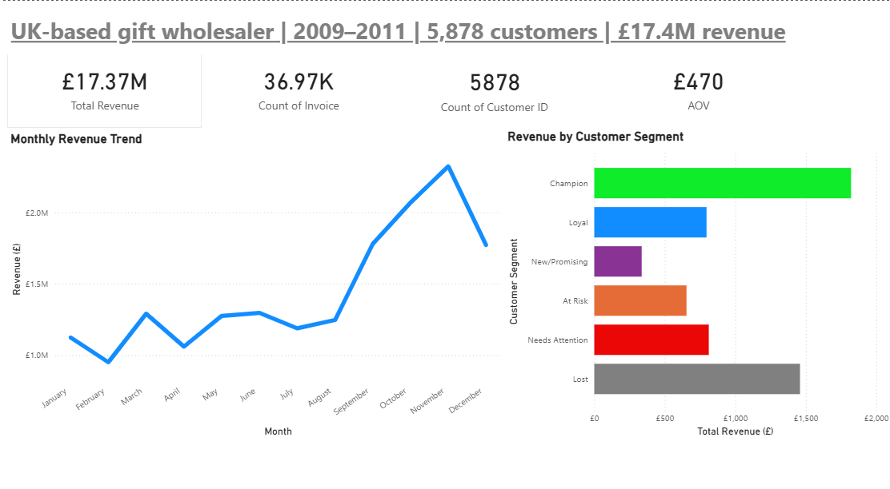
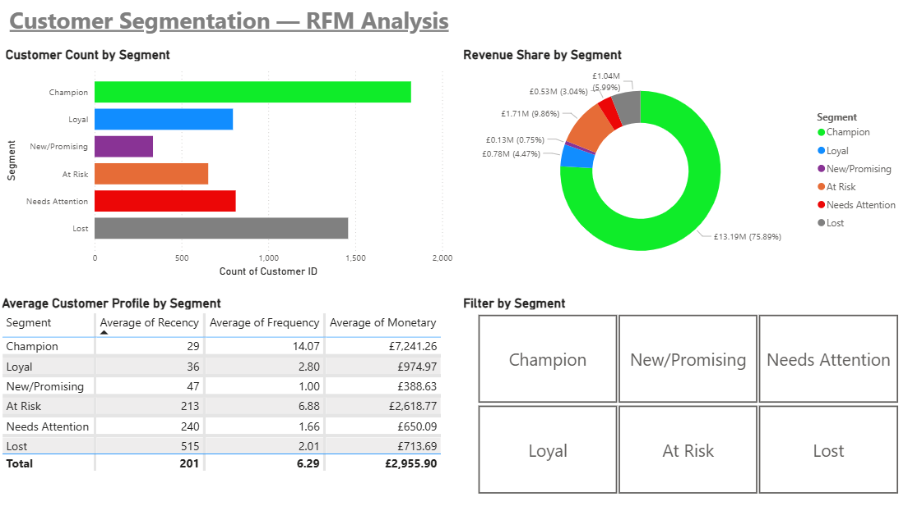
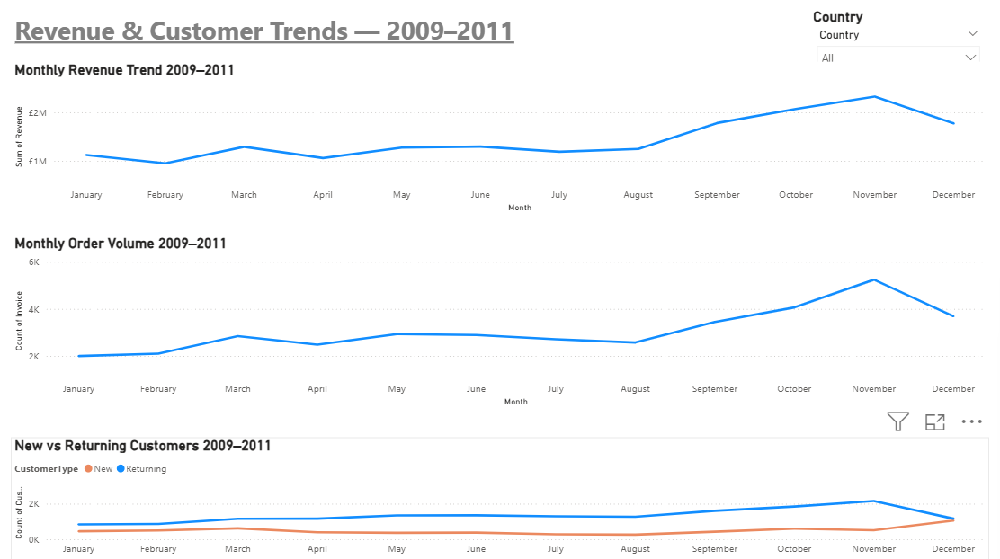

# uk-retail-customer-segmentation
Customer segmentation and RFM analysis of a UK-based online retailer using Python, SQL and Power BI

# UK Online Retail - Customer Segmentation & RFM Analysis

> Analysing 1M+ transactions from a UK wholesaler to segment 5,878 customers 
> by value using Python, SQL and Power BI - revealing that 31% of customers 
> drive 75.89% of revenue.

## Business Problem
A UK-based online gift and homewares wholesaler needed to understand 
who their most valuable customers are, whether they are retaining them, 
and where to focus commercial efforts to protect and grow revenue.

## Tools Used
- **Python** (Pandas, Matplotlib, Seaborn) - data cleaning and EDA
- **SQL** (SQLite) - segment validation and business profiling
- **Power BI** - interactive dashboard for stakeholder reporting

## Dataset
UCI Online Retail II Dataset via Kaggle - 1M+ transactions, 
2009–2011, cleaned to 779,425 rows.
[Dataset Link](https://www.kaggle.com/datasets/mashlyn/online-retail-ii-uci)

## Approach
1. Cleaned and explored the dataset in Python - handling nulls, 
   cancellations, duplicates and feature engineering
2. Conducted EDA across revenue, products, countries, order volume, 
   AOV and customer retention
3. Built an RFM model to score and segment 5,878 customers
4. Validated findings in SQL and built an interactive Power BI dashboard

## Key Findings
- **Champions (31% of customers) generate 75.89% of total revenue** - 
  the business is critically dependent on a small loyal base
- Revenue peaks every November driven by pre-Christmas wholesale stocking
- At Risk customers represent £1.7M in recoverable revenue - 
  these were frequent buyers who have not purchased in 7+ months
- No international market exceeds £1M - heavy UK concentration 
  represents a commercial risk

## Recommendations
1. **Protect Champions** - loyalty programme or dedicated account management
2. **Re-engage At Risk customers** - targeted outreach campaign, 
   these customers averaged 6.9 orders historically
3. **Develop Loyal customers** - recent but low frequency, 
   prime candidates for upsell campaigns
4. **Investigate April 2011 anomaly** - consistent weakness across 
   revenue, AOV and customer metrics warrants further analysis
5. **Explore international expansion** - EIRE, Netherlands and Germany 
   show potential but remain underdeveloped

## Files
- `rfm_segments.csv` - customer level RFM scores and segments
- `rfm_analysis.sql` - SQL queries for segment validation
- `UK_Retail_Customer_Segmentation.pbix` - Power BI dashboard
- Kaggle Notebook — data cleaning, EDA and RFM analysis

## Kaggle Notebook
[View full analysis on Kaggle](https://www.kaggle.com/code/matthewtwigge/uk-retailer-customer-segmentation-rfm)

## Dashboard Preview

### Executive Summary

### Customer Segments

### Trends

